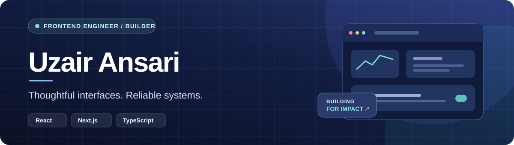

  

  <a href="https://uzairansari11.vercel.app/">Portfolio</a> &nbsp;·&nbsp;
  <a href="https://www.linkedin.com/in/uzairansari11/">LinkedIn</a> &nbsp;·&nbsp;
  <a href="mailto:uzairans532@gmail.com">Email</a>

### Hi, I'm Uzair 👋

I'm a frontend-focused software engineer based in Mumbai with around **3 years of experience** building production web applications. I enjoy turning complex workflows into clear interfaces, and I'm expanding that work into full-stack and AI-powered products.

| 4 production applications built from scratch | 1,500+ users on a calling platform | 3 junior developers mentored |
| :---: | :---: | :---: |

### What I've built

**AI-powered finance platform** · Built financial workflows and interfaces for AI-assisted analysis, streaming responses, and invoice processing. Later migrated the UI from HeroUI to shadcn/ui to improve customization and cross-browser consistency.

**Real-time calling platform** · Built a browser-based calling experience with React, SIP.js, and WebRTC. Worked through multi-session audio handling and cleanup for a platform serving **1,500+ users**.

**Enterprise CRM** · Built quotation and workflow features for a custom CRM, alongside an internal project-management application for task assignment and performance tracking.

**DocuMind — AI document assistant** · A personal project exploring document chat with RAG, semantic search, reranking, source citations, and streamed answers. It also includes background processing for AI-generated podcasts from PDFs. Built with Node.js, PostgreSQL, Prisma, Redis, Qdrant, and AWS S3.

### Code you can explore

| Project | What it shows | Stack |
| --- | --- | --- |
| [ChatApp](https://github.com/uzairansari11/ChatApp) | Real-time messaging across a frontend and API | React, Socket.IO, Express, MongoDB |
| [Product catalog](https://github.com/uzairansari11/simfoni_assignment) | Search, filtering, sorting, and responsive product pages | React, TypeScript, Redux, Tailwind CSS |
| [Resume Builder](https://github.com/uzairansari11/resume_builder) | Form-driven resume creation and PDF export | React, Bootstrap |

### My toolkit

| Focus | Technologies |
| --- | --- |
| Frontend | React, Next.js, TypeScript, JavaScript, Tailwind CSS, shadcn/ui |
| Data & state | Redux Toolkit, TanStack Query, REST APIs, Server-Sent Events |
| Backend | Node.js, Express, PostgreSQL, Prisma, MongoDB, Redis |
| AI features | RAG, LangChain, Qdrant, OpenAI APIs, background jobs |

Right now I'm deepening my work in **AI application architecture**, **FastAPI**, and **SQLAlchemy**. I like building products end to end, from an interface someone enjoys using to the systems that make it work.

---

  <b>Have an interesting product or engineering problem?</b> 
  <a href="mailto:uzairans532@gmail.com">Let's talk</a> · <a href="https://www.linkedin.com/in/uzairansari11/">Connect on LinkedIn</a>

